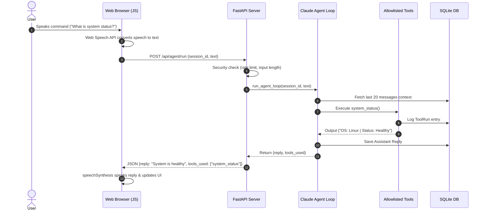
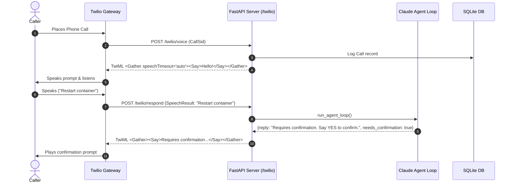

# System Architecture 🏛️

This document details the internal design, request flows, database schema, and architectural trade-offs of the Voice AI Agent.

---

## 🧩 Key System Components

1. **Web Frontend (`/static`)**:
   - Built with HTML5, Vanilla CSS, and JavaScript.
   - Utilizes `window.SpeechRecognition` (or `webkitSpeechRecognition`) for browser speech-to-text.
   - Uses `window.speechSynthesis` for client-side voice playback.

2. **Twilio Telephony Router (`app/twilio_routes.py`)**:
   - Exposes `/twilio/voice` and `/twilio/respond` endpoints.
   - Returns TwiML XML constructs (`<Gather>`, `<Say>`, `<Hangup>`).
   - Verifies HTTP request signatures against `TWILIO_AUTH_TOKEN`.

3. **FastAPI Application Core (`app/main.py` & `app/security.py`)**:
   - Manages middleware: CORS, IP rate limiting (30 req/min), daily caps, and input length checks.
   - Handles `X-API-Key` verification for programmatic REST clients.

4. **Claude Tool-Use Agent (`app/agent.py`)**:
   - Implements multi-turn tool evaluation loop (maximum 5 rounds).
   - Enforces a spoken-style system prompt (short, natural responses without Markdown formatting).
   - Manages retries (2 attempts) and fallback error responses.

5. **Allowlisted Tool Execution Engine (`app/tools.py`)**:
   - Maintains an explicit lookup table of safe functions (`system_status`, `list_files`, `docker_ps`, `git_status`, `current_time`, `http_check`, `restart_container`).
   - Prevents arbitrary command injection; no shell execution is allowed.
   - Enforces 2-step confirmation for state-altering actions (`restart_container`).

6. **Database Layer (`app/db.py`)**:
   - Built on SQLAlchemy ORM with SQLite backend.
   - Stores session call state (`Call`), dialogue turns (`Message`), and audited tool runs (`ToolRun`).

---

## 🔄 Sequence Diagrams

### 1. Browser Web Speech Flow



### 2. Twilio Telephony Flow



---

## 🗄️ Database Schema

```
+------------------+       +------------------+       +------------------+
|      Calls       |       |     Messages     |       |    ToolRuns      |
+------------------+       +------------------+       +------------------+
| id (PK)          |       | id (PK)          |       | id (PK)          |
| twilio_call_sid  |       | session_id (IDX) |       | session_id (IDX) |
| session_id (IDX) |       | role (user/asst) |       | tool_name        |
| status           |       | content          |       | input_params     |
| created_at       |       | created_at       |       | output           |
+------------------+       +------------------+       | status           |
                                                      | executed_at      |
                                                      +------------------+
```

---

## 📈 Future Upgrade Path

1. **Twilio Media Streams**: Replace basic `<Gather>` speech polling with WebSocket media streaming for sub-300ms bidirectional voice response times.
2. **Deepgram STT Integration**: Replace browser speech recognition with streaming Deepgram Nova-2 API for superior accuracy with technical terms and accents.
3. **ElevenLabs Neural TTS**: Integrate ElevenLabs websocket streaming API for ultra-realistic spoken audio responses on web and phone calls.
